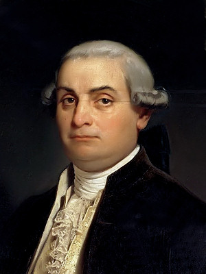
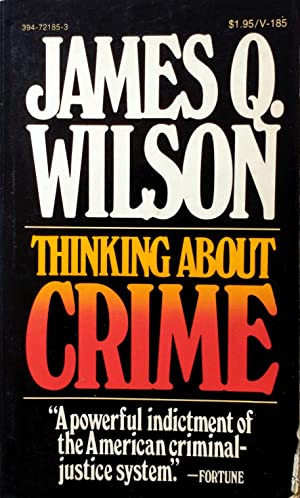
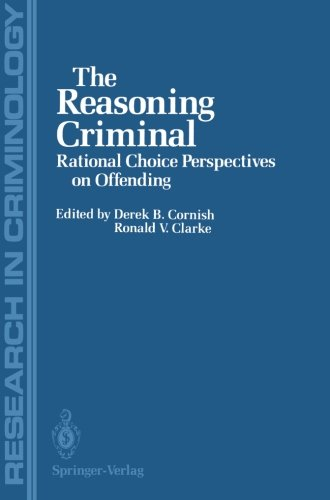
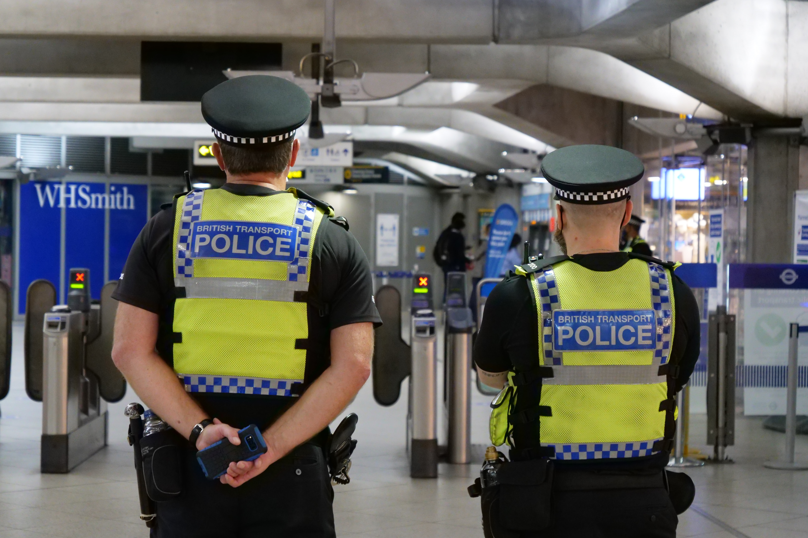
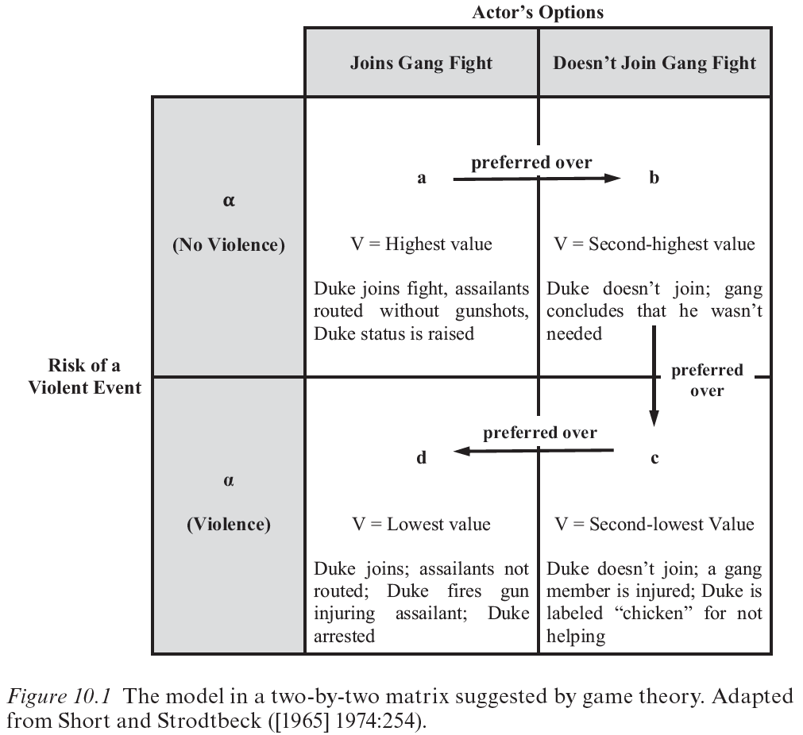
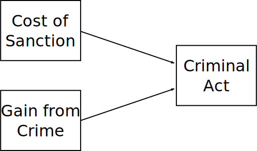

```{r setup, include = FALSE}
knitr::opts_chunk$set(echo=FALSE, warning = FALSE, message = FALSE, dev = "svg", fig.height = 5, dev.args=list(bg="transparent"))
library(tidyverse)
```


# Classic Deterrence

Basic idea: *You can **prevent crime** using **punishment***

Deterrence has long been basis for criminal justice policy

???

Classic deterrence principles underlie modern justice approaches in Europe and the US

--

.pull-left-70[
Beccaria (1764) *On Crimes and Punishments*

* People are rational and self-interested

   * *Individuals know what is best for them and act accordingly*
   * Restrain liberty only to *protect others*

]

.pull-right-30[

]

???

Specifically, deterrence goes back to Beccaria, generally considered the founding father of criminology

Individuals were seen to have no external influences on behavior and would correctly evaluate the consequences of all possible actions to take the result that maximizes pleasure and minimizes pain

This means people know best what is good for them, so we should maximize their freedom

But sometimes the best action for an individual hurts others, infringing on their liberty

To Beccaria, this is the only justified reason to infringe on free choice


---

# Classic Deterrence

Basic idea: *You can **prevent crime** using **punishment***

Deterrence has long been basis for criminal justice policy

.pull-left-70[
Beccaria (1764) *On Crimes and Punishments*

* People are rational and self-interested

   * *Individuals know what is best for them and act accordingly*
   * Restrain liberty only to *protect others*

* **Deterrence**

   * Punish only to *prevent crime* (not rehabilitate)
   * Punish only so much as *necessary*
   * Goal: *Make crime the irrational choice.*
]

.pull-right-30[

]

???

If people maximize pleasure and minimize pain, we can increase pain of harmful choices

But we do not want to harm more than is needed; we want to do only so much harm as is justified.

Beccaria's deterrence was not a criminological theory but a policy position resulting from his horror and disgust over barbaric European legal codes.


Focus is on act, not individuals: Change the calculus of acts rather than change values of the person.

A problem with this approach is calculating the right punishment. Even if you can measure it, pleasure from a criminal act might differ for everyone. Jeremy Bentham believed this was all quantifiable--a hedonic calculus. But Bentham was also a bit of a weird guy. His clothed skeleton and wax head are on display at University College, London.


---

# Modern Criminology

* Criminology rejected rational actor, adopted subcultural theories

    + No role for structure or context
    + Crime as irrational behaviour resulting from socialization


--

.pull-left-70[
* Deterrence (and incapacitation!) re-emerged in 70's and 80's

    + Pessimism about rehabilitative policy
    + **Rational choice**: more realistic model
       + People are *on average* rational
       + People respond to incentives
       + Structure and context matter

*We'll get back to rational choice in a bit*

]
.pull-right-30[

]

???

People's perceived rewards are idiosyncratic and taste-based; mainly just know that on average people want *more*, whatever it is

James Q. Wilson's book influential in advocating for both deterrence and incapacitation

---
#  Deterrence Doctrine

Deterrence is simply the idea that punishment can impact crime.

   + People *respond to incentives*

--

.pull-left-70[
Weaker rational actor assumptions than classical school:

* In **aggregate**, individuals act rationally
]
.pull-right-30[

]

???

If you look at large groups together, on average they behave rationally

---
count:false

#  Deterrence Doctrine

Deterrence is simply the idea that punishment can impact crime.

   + People *respond to incentives*

.pull-left-70[
Weaker rational actor assumptions than classical school:

* In **aggregate**, individuals act rationally

* At **margin**, individuals act rationally
]
.pull-right-30[

]


???

People may not act perfectly rationally, but they do respond to changes in incentives

If punishment increases, people will commit less crime; if gains increase, more.

---
count:false

#  Deterrence Doctrine

Deterrence is simply the idea that punishment can impact crime.

   + People *respond to incentives*

.pull-left-70[
Weaker rational actor assumptions than classical school:

* In **aggregate**, individuals act rationally

* At **margin**, individuals act rationally
]
.pull-right-30[

]

.text-center[
*You can reduce crime by increasing the costs*
]

---

class: inverse

# Deterrence Concepts

<br>



---
# Marginal vs. Absolute


* **Marginal Deterrence**

   + Deterrent effect of a *penalty* compared to a *different penalty*
   + *Does the death penalty reduce more crime than life sentences?*
   + Most research is focused here—evidence is mixed

???

This is if increasing or decreasing penalties increases or decreases behavior.

--

* **Absolute Deterrence**

   + Deterrent effect of a *penalty* compared to *no penalty*
   + *Will decriminalizing drugs result in more drug use?*
   + Less research here, but evidence is fairly strong for some crimes

???

This is question of whether *any penalty at all* has an effect on a behavior.

--

<br>

.text-center[
*People may be more sensitive to the existence of punishment than differences in punishment*
]

???

An important idea here is that having even a very minor penalty can sometimes make a big difference, but increasing it might have little additional effect

---
# 3 Deterrence Variables

* **Certainty** of being sanctioned

   + Probability of paying cost
   + Objective Measure: *Proportion of offenders arrested*
   + Subjective Measure: *Perceived punishment probability*
   + Tittle's "Shell of Illusion"

???


Shell of Illusion: Those never committing a crime--and thus never getting away with it--overestimate sanction risk.

This is related to the illusion most people have that certain types of law violation are incredibly rare; since at least Rome philosophers have stated that if people knew how often laws were broken, they too would break them.

--

* **Severity** of the sanction

   + The cost
   + Objective Measures: *Sentence length* or *fine amount*
   + Subjective Measure: *Perceived suffering*
   
???

Subjective usually involves asking people "how bad would it be to be arrested / incarcerated"

--

* **Celerity** (Swiftness) of the sanction

   + Length of time between crime and paying the cost
   
???

Most justice systems are pretty slow, so this component is not often used to control crime, and thus not often studied

The slowness may actually be a severity component too; people know they'll spend a lot of time even waiting for a hearing or trial

Strong deterrent effects of arrest may be because it occurs more quickly

--

.text-center[
*Evidence is strongest for **certainty***
]

---
# General Deterrence

*Does the **threat of punishment** deter people from crime?*

   + Perceived threat of sanctions deters individuals from crime
   + Based on perception, not personal experience
   + "Punish so that others see that they too will be punished"
   + About reducing *crime in general*

--

Research Approaches

   + Changes in crime rates before/after policy changes
   + Effects of perceived risk and severity
   + Effect of peers being arrested

---
# Specific Deterrence

*Does **being punished** deter people from committing more crime?*

   + Being punished deters individuals from committing more crime
   + Based on experience, occurs only after punishment
   + About reducing *recidivism*

???

Specific deterrence is about keeping people from reoffending

If they were punished once, they will realize they don't want that to happen again

--

Research Approaches

   + Compare incarcerated then released vs. probationers
       + But those sent to prison may be more crime prone
       + Experimental design: Need equivalent treatment and control groups
   + Randomly vary punishment
       + Randomized arrest (e.g. Sherman & Berk 1984)
   + Look at marginal cases—natural experiments
       + Same crime probation vs. incarceration
       + Harsher vs. more lenient judges

???

Specific deterrence can be hard to research--punishment often does more than just punish.

Not really ethical to experimentally vary *real* punishments; can try in experiments

---
class: inverse
# Rational Choice

<br>



.footnote[
Source: [Matsueda & Lanfear (2021)](http://faculty.washington.edu/matsueda/Papers/Short%20and%20Strodtbeck.pdf)
]

---
# Rational Choice Model

Deterrence focuses on sanctioning of crime.

Rational choice is a *general* theory of behaviour—not limited to crime.

--

Criminological rational choice models recognize variation in gains.
   
   + Includes material and psychic gains
   + e.g. Piliavin, Thornton, Gartner, & Matsueda (1986)



???

Research like Piliavin et al. finds better support for rational responses to rewards than to formal punishments

This may be due to low certainty


---
# Formalization

Rational choice models typically take a formal mathematical form.

$$
E(U) = (1-p)U(y)+pU(y-F)
$$
"Expected utility $E(U)$ is function of the value of crime $U(y)$, the likelihood of being caught $p$, and the penalty if caught $F$"

???

This is conventional economic utility model

Don't estimate exact values, but rather takes advantage of basic properties

All else equal, reducing reward / increasing cost reduces value and thus likelihood of crime.

--

Becker (1968) introduced rational model of crime

   + Little impact in sociology or criminology, major in economics
   + Assumed full information
   + Material gains compared to gains from legitimate job

???

First major economic treatment of crime as rational behavior

Mainly focused on criminal justice policy

--

Short & Strodtbeck's (1964) decision to join a gang fight

   + Subjective probability of harm
   + Bounded rationality
   + Status and psychic rewards

???

Mixed methods work revealing participation in gang fights as rational behavior

Gang leader decides whether or not to join a fight

If he decides not to, likely he will likely suffer moderate status loss with gang

If he does join fight, small chance he will need to shoot someone and end up in jail -- large cost

Because likelihood of jail is small, he'll probably join fight--it is rational to do so

---
# Implications

* **Changing costs**

   * Increasing costs reduces offending
   * **Perceived costs** are more important than real costs
       * *Signalling high certainty can more effective than actually increasing certainty*
   * Social and emotional costs
       * *Parents and peer shaming*
       * *Job loss*

???

Deterrence of course emerges naturally from rational choice: We can act on costs

But here costs are broader than formal punishment: Take into account everything a person risks by offending

--

* **Changing gains**

   * Reducing gains reduces offending
   * **Perceived gains** are what matter
   * Monetary value of goods, emotional value of criminal acts
       * *Thefts increase when goods become easier to sell*
       * Can be difficult to act on psychic gains

???

Classic deterrence perspective viewed gains as essentially static; rational choice opens up consideration of manipulating gains

You don't need to deter behaviours no one is interested in doing or is aware is profitable.

It can be difficult to make an offense "uncool" or otherwise reduce psychic or emotional gains, but there's evidence this has occurred to some degree for some drugs, like crack, and underage smoking due to their negative effects

---
# Behavioral Economics

Pogarsky, Roche, & Pickett (2018) "Offender Decision-Making in Criminology"


???

Behavioral econ emerged from cognitive psych contributions to econ research and has influenced thinking in criminological rational choice

The focus of behavioral econ is on systematic departures from rationality

--
* Bounded rationality

???

Short & Strodtbeck (1964) had an early handle on this before behavioral econ

People often have very little information when acting; can't assume perfect info

People rule out many possible decisions immediately and consider only a few options, often only two: fight or do not fight

--

* Prospect Theory (Kahneman & Tversky)

   + People risk averse in gains, risk seeking in losses
   + Underweight likely events, overweight unlikely events
   + *Expectations matter*

???

Strong evidence that gains/losses to crime are treated differently if a gain vs a loss

Nonlinearity in effects

Criminals likely to focus on easy guaranteed gains, but will prefer risk of larger loss to smaller certain loss, ex. resisting arrest

For same level of punishment, expectations shape later recidivism: Expecting worse, punishment deters less.

--

* Dual-Process Models

   + Much behavior is intuitive and rule (heuristic) based
   + Rational, deliberative behavior is costly
  
???

People generally like to avoid effort; rational choice thinking takes lots of effort

Most behavior is habitual and intuitive, something long recognized in sociology and social psychology

If you want to act on rational choice, need to trigger deliberative thinking; evidence exists that people who deliberate more are more averse to crime

--

* Heuristics and Biases

  + Shortcuts in uncertain environments
  + Replace hard question with easier one
  
???

May make large mistakes in reasoning by applying shortcuts or habitual behaviors to new situations

---

# Critiques

* Psychological critique

   * Deliberation is exceedingly rare
   * For most, criminal alternatives rarely considered

--

* Social psychological critique

   * Morals and norms dominate costs and benefits

--

* Pragmatist critique

   * Desires arise situationally
   * People choose means and ends simultaneously

???

The pragmatist critique is that people don't have ultimate beliefs and desires at all

Rather, people respond to problematic situations by considering different sets of actions and imagined outcomes and selecting the first good one

This may be something entirely novel and previously unconsidered; the action chosen doesn't stem from an existing desire

Consider when you get hungry. The solution to your problem is both the food and how you get that food.


--

<br>

.text-center[
"All models are wrong, but some are useful" - George Box

*Consider when the simple rational actor model will break down*
]

---
class: inverse

.pull-left[
# Deterrence and Rational Choice Applications
]

.pull-right[

]

---

# Criminological Theory

* *Rational actor assumptions are everywhere*
* Situational crime prevention
* Routine activities theory
* Broken windows
* Control theory

--

# Legal Sanctions

* "Tough-on-crime" sentencing policies

   * Poor evidence for **severity**

* Traffic enforcement

   * Speed and red light cameras (certainty)
   * Income-based fines (severity)


---

# Policing

.text-center[
*Deterrence and rational choice principles underlie most police crime control strategies*
]

--

* Hot spots policing

   + *Direct police resources where gains from deterrence are largest*

--

* Problem-oriented policing

   + *Increase real and perceived sanction risks for specific offenses*
   + e.g., focussed deterrence or "pulling levers"

--

* Proactive and disorder policing

   + *Increase perceived sanction risks in general*
   + e.g., order maintenance policing

--

* Deployment strategies

   + *Increase sanction risks or uncertainty*
   + e.g., foot patrol, randomized or intensified patrols

---
class: inverse

# Wrap-Up

* Deterrence is deeply embedded in justice system

* Rational choice 

## Further Reading

[Nagin, Solow, & Lum (2015) "Deterrence, criminal opportunities, and police." *Criminology* 53(1)](https://doi.org/10.1111/1745-9125.12057)

